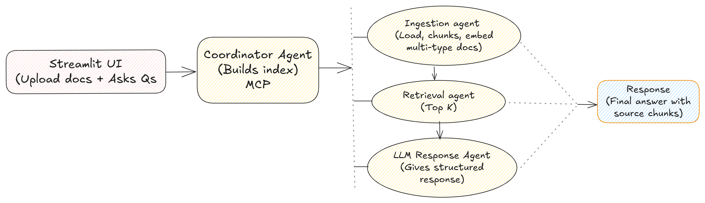

# 🔍 Multi-Agent Document Q&A Chatbot using MCP Protocol
Imagine having a smart assistant who can read your documents, understand your questions, and provide helpful answers—showing exactly where the answer came from. This project builds such a smart assistant using a team of specialized “agents” working together.

### 🚩 Problem Statement — What is the problem?
Most current document question-answering systems are built as one big "black box." They:

-- Don’t work well across different document types like PDFs, PowerPoints, or Excel sheets.
-- Don’t keep track of conversation history well for follow-up questions.
-- Provide answers without showing where those answers came from (making it hard to trust).
-- Are hard to improve or customize because everything is mixed together.

In simple terms, existing tools can’t easily give clear, referenced answers to your questions from many kinds of documents, especially during a back-and-forth chat.

## ✅ Solution — How does this project fix it?
We solve this by breaking down the process into smaller, smart "agents," each doing one specific job:

-- IngestionAgent: Reads and understands your uploaded documents—no matter if it’s a PDF, PPT, or spreadsheet.
-- IndexAgent: Organizes and stores pieces of the document in a way that’s easy to search.
-- RetrievalAgent: Finds the most relevant parts of your documents based on what you ask.
-- LLMResponseAgent: Combines those pieces and asks a smart language model (like GPT) to craft a clear, natural answer.

These agents all “talk” to each other using a simple, standard way called **Model Context Protocol (MCP)** , which helps keep the whole conversation and process organized and traceable—like passing notes with clear instructions between teammates.

### 🧠 Architecture — How does the system work inside?
Think of this like a restaurant kitchen with four specialists:

-- IngestionAgent (The Prep Cook): Carefully reads every document you upload and slices it into manageable, understandable chunks.
-- IndexAgent (The Storekeeper): Puts those chunks neatly into the pantry (a smart storage called a VECTOR database) so they can be found quickly later.
-- RetrievalAgent (The Waiter): When a customer (you) asks a question, the waiter looks through the pantry to find the most relevant ingredients (information chunks).
-- LLMResponseAgent (The Chef): Takes those ingredients and cooks up a delicious, easy-to-understand answer with references to the original documents.

These agents coordinate smoothly by sending messages in a common language (MCP), so everyone knows exactly what to do next.

## 🌟 Features — What cool things does this bot offer?

- Upload many document types: Whether your file is a PDF report, PowerPoint slides, Word docs, simple text files, or even spreadsheets – it can handle all.
- User-friendly chat interface: Using Streamlit (a tool for creating nice web apps), you get a clean, blue-themed chat window that’s fun and easy to use.
- Supports multi-turn Q&A: You can ask follow-up questions naturally, and the bot remembers context—like chatting with a knowledgeable friend.
- Shows cited sources: Answers come with exact references showing where the information was found, so you can double-check or learn more.

## 🚀 Future Improvements — What’s coming next?
Smarter agent coordination: Using tools like LangGraph or OpenAI Assistants to route questions automatically to the right expert agent.

Document summarization & topics: Helping you get quick overviews or key themes before diving into details.

Team collaboration: Multiple users working on shared documents with access controls—perfect for workplace use.

Real-time streaming answers: See answers being generated live, making interactions even more dynamic and engaging.
